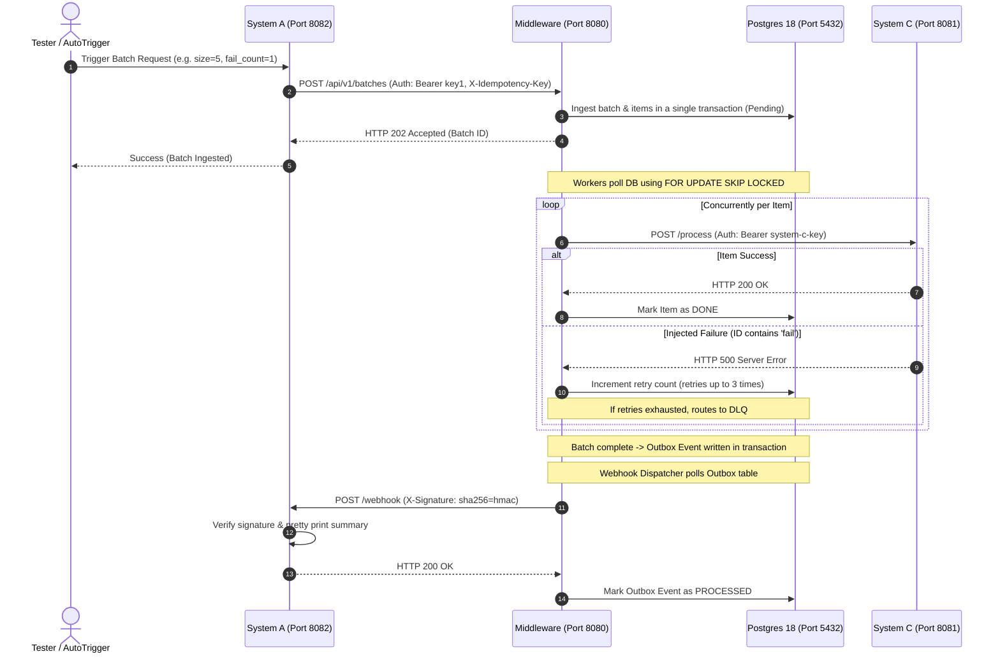

# Demonstration & Testing Simulators (System A & System C)

This directory contains simulator programs designed to demonstrate the complete, end-to-end capabilities of the **Batch Processing Middleware**.

## 1. Architectural Overview

The demonstration architecture mimics a real-world enterprise setup where:
- **System A** (Upstream client) submits massive batches of jobs via secure APIs, then listens for an asynchronous, signature-verified webhook indicating batch processing completion.
- **Middleware** ingests, validates, de-duplicates, tracks, and processes each item concurrently using resilient workers.
- **System C** (Downstream target) receives the processed items individually via HTTP with rate-limiting and circuit-breaking protection.



---

## 2. Quick Start (Zero Setup)

The entire environment—including database creation, automatic migrations, the middleware backend, and both simulators—is fully containerized and automated.

Simply run the following command in the project root:

```bash
docker-compose up --build
```

### What happens automatically on startup:
1. **Postgres** boots up and initializes the database.
2. **db_migration** runs all pending schema migrations located in the `/migrations` folder.
3. **middleware** builds, connects to Postgres, starts its background worker pool and webhook dispatcher, and begins listening on port `:8080`.
4. **systemc** simulator starts up and listens on port `:8081`.
5. **systema** simulator starts up and listens on port `:8082`.
6. **Automatic Demonstration**: After 5 seconds, **System A** automatically triggers a test batch of 5 items, containing **1 failure** (`fail-item-...`). You can watch the entire flow unfold in your docker logs!

---

## 3. Simulator Configurations

Both simulators support detailed behavioral tweaking via environment variables defined in `docker-compose.yml`:

### System C (Downstream Target)
- `SYSTEM_C_PORT` (default: `8081`): The port to listen on.
- `SYSTEM_C_API_KEY` (default: `system-c-key`): The Bearer authorization key required by the middleware.
- `SYSTEM_C_LATENCY_MS` (default: `100`): Artificial delay added to each item process request to simulate real workload latency.
- `SYSTEM_C_FAILURE_RATE` (default: `0.0`): Float representing the probability (0.0 to 1.0) of returning a random HTTP 500 error.
- `SYSTEM_C_FAIL_ID_PATTERN` (default: `fail-item`): If an item's `external_id` contains this string, System C will **always** fail with HTTP 500, enabling highly deterministic failure and retry testing.

### System A (Upstream & Webhook Consumer)
- `SYSTEM_A_PORT` (default: `8082`): The port to listen on.
- `MIDDLEWARE_URL` (default: `http://middleware:8080`): The target middleware base URL.
- `WEBHOOK_URL` (default: `http://systema:8082/webhook`): The callback URL sent to the middleware for completed batches.
- `MIDDLEWARE_API_KEY` (default: `key1`): The Bearer API Key required to authenticate against the middleware.
- `WEBHOOK_SECRET` (default: `some-generated-secret`): The shared secret key used to verify the HMAC-SHA256 signature of incoming webhooks.
- `AUTO_TRIGGER` (default: `true`): Automatically trigger a demo batch on container startup.

---

## 4. Manual Testing Scenarios

You can interact with System A's trigger API using `curl` from your host terminal to test specific resilient scenarios.

### Scenario A: Fully Successful Batch
Submit a batch of 10 items, all of which will succeed:
```bash
curl -X POST "http://localhost:8082/trigger?size=10&fail_count=0"
```
* **Observation**:
  - System A sends the batch to the middleware.
  - Middleware workers pick up all 10 items, send them to System C, and receive HTTP 200 responses.
  - Webhook dispatcher delivers the completion webhook to System A.
  - System A prints a beautiful `🟢 done` summary showing `10 succeeded, 0 failed`.

### Scenario B: Resilient Retries & Partial Success
Submit a batch of 8 items, where 2 items are configured to fail:
```bash
curl -X POST "http://localhost:8082/trigger?size=8&fail_count=2"
```
* **Observation**:
  - System A creates 8 items. The first 2 will have `fail-item` in their IDs.
  - System C returns HTTP 500 for these 2 items.
  - Middleware workers log the failures and reschedule them with exponential backoff (up to 3 retries).
  - The other 6 items succeed immediately.
  - The failed items are retried. Since they are deterministically configured to always fail, they will eventually exhaust all 3 retries.
  - **Dead Letter Queue (DLQ)**: Once retries are exhausted, the 2 failed items are moved to the DLQ table.
  - **Webhook Delivery**: The batch is resolved with a `partial` status. System A receives the webhook showing `6 succeeded, 2 failed` along with detailed failure reasons for the 2 items!

### Scenario C: Idempotency Key Protection
Submit a request with a custom idempotency key twice:
```bash
# 1. First trigger
curl -X POST "http://localhost:8082/trigger?size=3&idempotency_key=my-custom-key-123"

# 2. Duplicate trigger
curl -X POST "http://localhost:8082/trigger?size=3&idempotency_key=my-custom-key-123"
```
* **Observation**:
  - The first trigger is accepted and processed.
  - The second trigger returns the **same Batch ID** immediately from the middleware's idempotency cache, preventing duplicate database ingestion or processing!

### Scenario D: Simulating Transient Failures & Circuit Breaking
To demonstrate circuit breaking, you can set the random failure rate of System C to high in `docker-compose.yml` (e.g. `SYSTEM_C_FAILURE_RATE=0.6`) and restart:
```bash
# Submit a large batch
curl -X POST "http://localhost:8082/trigger?size=30&fail_count=0"
```
* **Observation**:
  - Due to the high failure rate, consecutive errors will exceed the threshold (50% failure ratio over 10 requests).
  - The middleware's internal **Circuit Breaker** will trip and transition to the `OPEN` state.
  - Subsequent items will fail instantly with a `"system C unavailable (circuit breaker open)"` error, protecting both the middleware and System C from load degradation.
  - Once the open timeout expires, it goes to `HALF-OPEN` and slowly lets traffic through to recover.

---

## 5. Checking Data in Postgres

If you want to view the database state directly, you can connect to the running PostgreSQL container:

```bash
docker exec -it postgres_db psql -U middleware_user -d middleware_db
```

### Useful SQL Queries:
- View all batches: `SELECT id, status, total_items, processed_items, failed_items FROM batches;`
- View all dead letter items: `SELECT * FROM dead_letter_queue;`
- View idempotency cache: `SELECT * FROM idempotency_keys;`
- View outbox queue status: `SELECT id, event_type, status, retry_count FROM outbox_events;`
