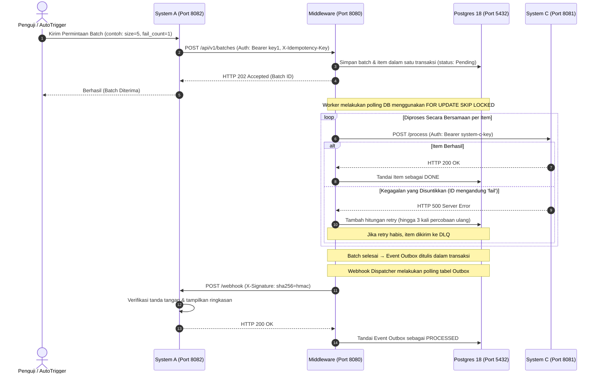

# Simulator Demonstrasi & Pengujian (System A & System C)

Direktori ini berisi program simulator yang dirancang untuk mendemonstrasikan kemampuan lengkap **Batch Processing Middleware** secara menyeluruh dari ujung ke ujung (*end-to-end*).

## 1. Gambaran Arsitektur

Arsitektur demonstrasi ini meniru lingkungan enterprise nyata di mana:
- **System A** (Klien Upstream) mengirimkan kumpulan pekerjaan dalam jumlah besar melalui API yang aman, kemudian menunggu webhook asinkron yang telah diverifikasi tanda tangannya sebagai tanda bahwa pemrosesan batch selesai.
- **Middleware** menerima, memvalidasi, mendeduplikasi, melacak, dan memproses setiap item secara bersamaan menggunakan worker yang tangguh.
- **System C** (Target Downstream) menerima setiap item yang diproses satu per satu melalui HTTP dengan perlindungan *rate-limiting* dan *circuit-breaking*.



---

## 2. Cara Cepat Memulai (Tanpa Setup Manual)

Seluruh lingkungan — termasuk pembuatan database, migrasi skema otomatis, backend middleware, dan kedua simulator — sudah sepenuhnya dikontainerisasi dan diotomatisasi.

Cukup jalankan perintah berikut di direktori root proyek:

```bash
docker-compose up --build
```

### Yang terjadi secara otomatis saat startup:
1. **Postgres** melakukan booting dan menginisialisasi database.
2. **db_migration** menjalankan semua migrasi skema yang belum diterapkan dari folder `/migrations`.
3. **middleware** melakukan build, terhubung ke Postgres, memulai *worker pool* dan *webhook dispatcher* di latar belakang, lalu mulai mendengarkan di port `:8080`.
4. Simulator **systemc** mulai berjalan dan mendengarkan di port `:8081`.
5. Simulator **systema** mulai berjalan dan mendengarkan di port `:8082`.
6. **Demonstrasi Otomatis**: Setelah 5 detik, **System A** secara otomatis mengirimkan batch uji berisi 5 item dengan **1 kegagalan** (`fail-item-...`). Pantau keseluruhan alurnya melalui log Docker!

---

## 3. Konfigurasi Simulator

Kedua simulator mendukung penyesuaian perilaku secara detail melalui variabel lingkungan yang didefinisikan di `docker-compose.yml`:

### System C (Target Downstream)
| Variabel | Default | Keterangan |
|---|---|---|
| `SYSTEM_C_PORT` | `8081` | Port yang digunakan untuk mendengarkan. |
| `SYSTEM_C_API_KEY` | `system-c-key` | Kunci Bearer yang dibutuhkan middleware untuk autentikasi. |
| `SYSTEM_C_LATENCY_MS` | `100` | Penundaan buatan (ms) per item untuk mensimulasikan latensi beban kerja nyata. |
| `SYSTEM_C_FAILURE_RATE` | `0.0` | Nilai float (0.0–1.0) yang mewakili probabilitas kembalinya error HTTP 500 secara acak. |
| `SYSTEM_C_FAIL_ID_PATTERN` | `fail-item` | Jika `external_id` suatu item mengandung string ini, System C **selalu** gagal dengan HTTP 500, memungkinkan pengujian kegagalan dan retry yang deterministik. |

### System A (Upstream & Konsumen Webhook)
| Variabel | Default | Keterangan |
|---|---|---|
| `SYSTEM_A_PORT` | `8082` | Port yang digunakan untuk mendengarkan. |
| `MIDDLEWARE_URL` | `http://middleware:8080` | URL dasar middleware yang dituju. |
| `WEBHOOK_URL` | `http://systema:8082/webhook` | URL callback yang dikirimkan ke middleware untuk batch yang telah selesai. |
| `MIDDLEWARE_API_KEY` | `key1` | Kunci API Bearer untuk autentikasi ke middleware. |
| `WEBHOOK_SECRET` | `some-generated-secret` | Kunci rahasia bersama untuk memverifikasi tanda tangan HMAC-SHA256 pada webhook masuk. |
| `AUTO_TRIGGER` | `true` | Otomatis mengirimkan batch demo saat container startup. |

---

## 4. Skenario Pengujian Manual

Anda dapat berinteraksi dengan API trigger milik System A menggunakan `curl` dari terminal host untuk menguji skenario ketangguhan tertentu.

### Skenario A: Batch yang Sepenuhnya Berhasil
Kirimkan batch berisi 10 item, semuanya akan berhasil:
```bash
curl -X POST "http://localhost:8082/trigger?size=10&fail_count=0"
```
**Yang terjadi:**
- System A mengirimkan batch ke middleware.
- Worker middleware memproses semua 10 item, mengirimkannya ke System C, dan menerima respons HTTP 200.
- Webhook dispatcher mengirimkan webhook penyelesaian ke System A.
- System A menampilkan ringkasan `🟢 done` yang menunjukkan `10 berhasil, 0 gagal`.

---

### Skenario B: Retry Tangguh & Keberhasilan Sebagian
Kirimkan batch berisi 8 item di mana 2 item dikonfigurasi untuk gagal:
```bash
curl -X POST "http://localhost:8082/trigger?size=8&fail_count=2"
```
**Yang terjadi:**
- System A membuat 8 item. 2 item pertama memiliki `fail-item` di dalam ID-nya.
- System C mengembalikan HTTP 500 untuk 2 item tersebut.
- Worker middleware mencatat kegagalan dan menjadwalkan ulang dengan *exponential backoff* (hingga 3 kali retry).
- 6 item lainnya berhasil secara langsung.
- Item yang gagal dicoba ulang. Karena dikonfigurasi untuk selalu gagal secara deterministik, semua 3 retry akan habis.
- **Dead Letter Queue (DLQ)**: Setelah retry habis, 2 item gagal dipindahkan ke tabel DLQ.
- **Pengiriman Webhook**: Batch diselesaikan dengan status `partial`. System A menerima webhook yang menampilkan `6 berhasil, 2 gagal` beserta alasan kegagalan detail untuk setiap item!

---

### Skenario C: Perlindungan Kunci Idempoten
Kirimkan permintaan dengan kunci idempoten kustom sebanyak dua kali:
```bash
# 1. Trigger pertama
curl -X POST "http://localhost:8082/trigger?size=3&idempotency_key=kunci-kustom-saya-123"

# 2. Trigger duplikat
curl -X POST "http://localhost:8082/trigger?size=3&idempotency_key=kunci-kustom-saya-123"
```
**Yang terjadi:**
- Trigger pertama diterima dan diproses.
- Trigger kedua mengembalikan **Batch ID yang sama** secara langsung dari cache idempoten middleware, mencegah duplikasi penyimpanan ke database atau pemrosesan ganda!

---

### Skenario D: Mensimulasikan Kegagalan Sementara & Circuit Breaking
Untuk mendemonstrasikan circuit breaking, atur tingkat kegagalan acak System C menjadi tinggi di `docker-compose.yml` (contoh: `SYSTEM_C_FAILURE_RATE=0.6`) lalu restart:
```bash
# Kirimkan batch dalam jumlah besar
curl -X POST "http://localhost:8082/trigger?size=30&fail_count=0"
```
**Yang terjadi:**
- Akibat tingkat kegagalan yang tinggi, error berturut-turut akan melampaui ambang batas (rasio kegagalan 50% dari 10 permintaan).
- **Circuit Breaker** internal middleware akan terpicu dan beralih ke status `OPEN`.
- Item berikutnya akan langsung gagal dengan error `"system C unavailable (circuit breaker open)"`, melindungi middleware dan System C dari penurunan beban.
- Setelah batas waktu *open* berakhir, status beralih ke `HALF-OPEN` dan secara perlahan meneruskan lalu lintas untuk pemulihan.

---

## 5. Melihat Data di Postgres

Jika ingin melihat status database secara langsung, hubungkan ke container PostgreSQL yang sedang berjalan:

```bash
docker exec -it postgres_db psql -U middleware_user -d middleware_db
```

### Query SQL yang Berguna:
```sql
-- Lihat semua batch beserta statusnya
SELECT id, status, total_items, processed_items, failed_items FROM batches;

-- Lihat semua item yang masuk Dead Letter Queue
SELECT * FROM dead_letter_queue;

-- Lihat cache kunci idempoten
SELECT * FROM idempotency_keys;

-- Lihat status antrian outbox (pengiriman webhook)
SELECT id, event_type, status, retry_count FROM outbox_events;
```

---

## 6. Port Layanan

| Layanan | Port Host | Keterangan |
|---|---|---|
| Middleware | `8080` | API utama untuk mengirimkan batch |
| System C | `8081` | Simulator target downstream |
| System A | `8082` | Simulator klien upstream & endpoint `/webhook` |
| PostgreSQL | `5432` | Database utama |
| Prometheus | `9090` | Endpoint metrik observabilitas |
